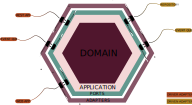

# Reecheble Finance Web-API


Reecheble Finance **Web-API** application built in Python using the
`Ports & Adapters` architecture.



## Developer Setup Guide

This section outlines the development setup of the Reecheble Finance **Web-API** application.
> **_NOTE:_** These steps will apply when the project's directory has been set as
> the working directory. Adjust accordingly if the working directory is different
> from project directory.


1. Clone the repository to your development environment.
   ```
   git clone <repository_url>
   ```
2. Install `poetry` to the environment using `pip`. Poetry can be installed system-wide.
   ```
   pip install poetry
   ```
3. Install project dependencies using `poetry`.
   ```
   poetry install
   ```
4. Activate `pre-commit` hooks. (*An optional step for devs who like structured commit messages*)
   ```
   poetry run pre-commit install --hook-type commit-msg --hook-type pre-push
   ```
5. Pull and startup the `latest` mongodb docker image. (You can use Mongo Atlas instead of running a local instance)
   ```
   docker run --name mongodb -d -p 27017:27017 -v $(pwd)/data:/data/db mongo:latest
   ```
6. Install [Mongo Compass](https://www.mongodb.com/docs/compass/current/install/) to view your mongo documents locally (
   *Optional*)
7. Start the server by running the `main.py` file located in the project directory.

8. Visit [API Host Service](http://0.0.0.0:8000/latest/docs) to view documentation.

## Docker Setup Guide [In Development]

This section outlines the setup for a docker container.

## Stack Overview

### Overall

| Library      | Description             | External Content                                                                                                             |
|--------------|-------------------------|------------------------------------------------------------------------------------------------------------------------------|
| [pymongo]()  | MongoDB Driver          | [Introduction](https://pymongo.readthedocs.io/en/stable/) > [Deep Dive](https://pymongo.readthedocs.io/en/stable/)           |
| [pydantic]() | Parser                  | [Introduction](https://docs.pydantic.dev/latest/) > [Deep Dive](https://docs.pydantic.dev/latest/)                           |
| [asyncio]()  | Asynchronous processing | [Introduction](https://docs.python.org/3/library/asyncio.html) > [Deep Dive](https://docs.python.org/3/library/asyncio.html) |

### API Server
The swagger document can be found at [API Host Service](http://0.0.0.0:8000/latest/docs)

| Library                                 | Description            | External Content                                                                                                                                                         |
|-----------------------------------------|------------------------|--------------------------------------------------------------------------------------------------------------------------------------------------------------------------|
| [fastAPI](https://fastapi.tiangolo.com) | Design & document APIs | [Introduction](https://blog.devgenius.io/brief-introduction-to-fastapi-d6f25793b11a) > [Deep Dive](https://blog.devgenius.io/brief-introduction-to-fastapi-d6f25793b11a) |
| [uvicorn](https://www.uvicorn.org/)     | Web Server             | [Introduction](https://www.uvicorn.org/) > [Deep Dive](https://www.uvicorn.org/)                                                                                         |

### Testing
| Library                                                              | Description                 | External Content                                                                                                                                     |
|----------------------------------------------------------------------|-----------------------------|------------------------------------------------------------------------------------------------------------------------------------------------------|
| [pytest](https://docs.pytest.org/en/7.1.x/index.html)                | Testing framework           | [Introduction](https://docs.pytest.org/en/7.1.x/getting-started.html) > [Deep Dive](https://docs.pytest.org/en/7.1.x/reference/reference.html)       |
| [unittest](https://docs.python.org/3/library/unittest.html)          | UnitTest creation framework | [Introduction](https://docs.python.org/3/library/unittest.html) > [Deep Dive](https://docs.python.org/3/library/unittest.html)                       |
| [hypothesis](https://hypothesis.readthedocs.io/en/latest/index.html) | UnitTest creation framework | [Introduction](https://hypothesis.readthedocs.io/en/latest/quickstart.html) > [Deep Dive](https://hypothesis.readthedocs.io/en/latest/settings.html) |

### Database

| Library     | Description | External Content                                                                 |
|-------------|-------------|----------------------------------------------------------------------------------|
| [mongodb]() | Database    | [Introduction](https://www.mongodb.com/) > [Deep Dive](https://www.mongodb.com/) |

## Features

### Included
- [X] Dependency setup using poetry
- [X] Rolling file logging with console output
- [X] Swagger Documented APIs (FastAPI)
- [x] Unit Testing

### Feature Backlog

- [ ] Docker containerization
- [ ] Kubernetes cluster integration
- [ ] Event messaging integration
- [ ] API Stress Testing
